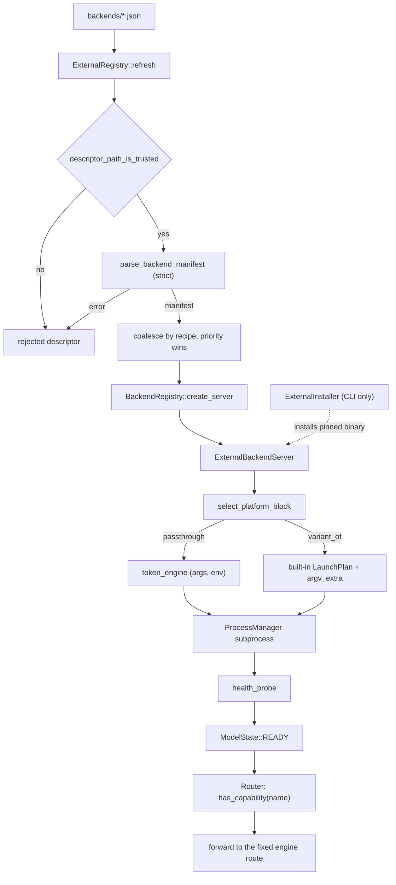

# External Backends

An **external backend** is an out-of-tree inference engine described by a JSON manifest. `lemond` discovers the manifest at runtime, launches the engine as a subprocess, health-probes it, and proxies Lemonade's fixed routes onto it. No C++ rebuild is required, so the engine can be a fork, a nightly, a container image, or an internal build.

This document is the maintainer-facing contract for RFC01. The user-facing guide is [External backends](../guide/configuration/external-backends.md). The normative schema is [`external-backend.v1.schema.json`](../../src/cpp/resources/schemas/external-backend.v1.schema.json).

- [Architecture](#architecture)
- [Strict validation contract](#strict-validation-contract)
- [Discovery and descriptor trust](#discovery-and-descriptor-trust)
- [Capability gating across the router](#capability-gating-across-the-router)
- [Adding a new capability](#adding-a-new-capability)
- [The `variant_of` launch-plan seam](#the-variant_of-launch-plan-seam)
- [The RFC02 boundary](#the-rfc02-boundary)
- [Known gaps](#known-gaps)

## Architecture



| Component | Files | Responsibility |
|-----------|-------|----------------|
| `BackendManifest` + `parse_backend_manifest` | `src/cpp/include/lemon/external/backend_manifest.h`, `src/cpp/server/backends/external/backend_manifest.cpp` | Plain-data manifest and the strict parser/validator. |
| Capability registry | `src/cpp/include/lemon/external/capability_registry.h`, `src/cpp/server/backends/external/capability_registry.cpp` | Maps a manifest capability name to a deployment-mode label, a route, and flags (`has_mode`, `variant_of_only`). |
| Token vocabulary | `src/cpp/include/lemon/external/token_vocabulary.h`, `src/cpp/server/backends/external/token_vocabulary.cpp` | The set of legal `{...}` names and the parse-time token validator. |
| Token engine | `src/cpp/include/lemon/external/token_engine.h`, `src/cpp/server/backends/external/token_engine.cpp` | Launch-time substitution of tokens into argv and env, plus the environment allowlist and reserved-arg checks. |
| `ExternalRegistry` | `src/cpp/include/lemon/external/external_registry.h`, `src/cpp/server/backends/external/external_registry.cpp` | Discovery, descriptor trust, coalescing by recipe, and the background watcher. |
| `ExternalInstaller` | `src/cpp/include/lemon/external/external_installer.h`, `src/cpp/server/backends/external/external_installer.cpp` | CLI-side download, hash verification, extraction, and install of a `variant_of` binary. |
| `ExternalBackendServer` | `src/cpp/include/lemon/backends/external/external_backend_server.h`, `src/cpp/server/backends/external/external_backend_server.cpp` | One instance per load: platform selection, launch, health probe, capability gate, and route proxying. |
| Wiring | `src/cpp/server/backends/backend_registry.cpp`, `src/cpp/server/system_info.cpp`, `src/cpp/cli/external_backends.cpp` | Creates the server for a recipe, surfaces external recipes in `/system-info`, and implements `install-external` / `uninstall-external`. |

`BackendRegistry::create_server` is the entry point. For a recipe that is not a built-in it refreshes the registry once (treating every built-in recipe as reserved), starts the watcher, and returns an `ExternalBackendServer` bound to the manifest. `/system-info` refreshes the registry on its first call so external recipes are enumerable before they are ever loaded.

## Strict validation contract

The parser rejects rather than ignores. There are no silent fallbacks.

- **`api_contract_version`** is compared to `kSupportedContractVersion` (`"1"`). A value above the supported major is rejected with a message naming both versions, and is never partially honored.
- **Unknown fields are rejected at every object level.** Each object has an explicit key allowlist (`check_allowed_keys` in `backend_manifest.cpp`), and the JSON schema declares `additionalProperties: false`. The only open objects are `recipe_options` and `extensions`.
- **Unknown capability names are rejected.** The manifest capability set is closed and validated against the capability registry.
- **Unknown tokens are rejected at parse time.** `validate_tokens_in_string` runs over `command`, `args`, `working_dir`, `stop_command`, `stop_command_args`, `argv_extra`, and `env` values. Empty braces, nested braces, unterminated braces, and malformed `custom:`/`env:` specs all fail discovery.
- **Structural invariants are enforced.** `extends` and `variant_of` are mutually exclusive. `source`, `sha256`, and `version_policy` are valid only with `variant_of`. A `variant_of` with the default `pinned` policy requires `sha256`. `binary` is valid only with `variant_of`, and must be a bare executable name. Passthrough blocks require `command` and `args` together. `requested_ports` must equal `1`.
- **Recipe ids and binary names are pattern-checked.** A recipe id must match `^[a-z0-9][a-z0-9_-]{1,63}$`. A `binary` must match `^[A-Za-z0-9][A-Za-z0-9._-]*$` (no path separators or traversal).

Because the capability name set and token vocabulary are closed, adding a first-class capability name or a token is a change to `api_contract_version` major 1 and requires a new major for manifests to use it. `extensions` is the only forward-compatible seam within major 1.

The same strictness applies to discovery-time conflicts: a recipe that collides with a built-in, or that is already claimed by a higher-priority path, is rejected with a reason.

## Discovery and descriptor trust

`default_discovery_paths()` derives the search roots from the environment (XDG, `HOME`, `APPDATA`, `ProgramData`), so the CLI can use the same roots as `lemond`. `ExternalRegistry::refresh` processes them in priority order (user config, user cache, system), coalesces manifests by recipe, and records rejected descriptors.

Before a descriptor is parsed, `descriptor_path_is_trusted` checks it:

- POSIX: reject symlinks and non-regular files; reject any group or world write bit (`mode & 0022`); require the current user for a user path or root for a system path; reject an ancestor owned by another user that is group/world writable and lacks the sticky bit.
- Windows: require the owner to be the process user, Administrators, or LocalSystem (for a system path); reject a DACL that grants write to `Everyone` or `Users`.

The registry owns parsed manifests for its lifetime; callers hold non-owning pointers. `start_watcher` runs a detached thread that polls the last-used paths every 2 seconds and refreshes on change. Rejection reasons currently live only in `ExternalRegistry::rejected()`; they are not surfaced through the API or logged.

## Capability gating across the router

`ICapability::has_capability` defaults to `true`, so a built-in backend serves everything it implements. `ExternalBackendServer::has_capability` overrides this to membership in the manifest's declared capability set. The router consults it before dispatching:

| Route | Router Gate |
|-------|-------------|
| Chat completions | `has_capability("chat_completion")` |
| Completions | `has_capability("completion")` |
| Embeddings | `has_capability("embeddings")` |
| Rerank | `has_capability("reranking")` |
| Classify | `has_capability("classification")` |
| Transcriptions | `has_capability("transcription")` |
| Streaming transcription | `has_capability("streaming_transcription")` |
| TTS | `has_capability("tts")` |
| Images (generations, edits, variations) | `has_capability("image")` |
| Audio generation | `has_capability("audio_generation")` |
| 3D generation | `has_capability("model_3d")` |
| Slots | `has_capability("slots")` |
| Tokenize | `has_capability("tokenize")` |
| Responses | `has_capability("responses")` |

A failed gate becomes the standard `unsupported_operation` envelope, the same error a backend returns when it does not implement an interface. The `dynamic_cast` to the capability interface and the declared-capability check are both required: the manifest decides whether the route is shown, and the interface decides whether there is code to serve it.

Capability names deliberately differ from deployment-mode labels. The mapping is explicit in `capability_registry.cpp` so a manifest can never imply a mode the code does not have. `streaming_transcription` is marked `variant_of_only` and rejected for passthrough manifests. `slots` and `tokenize` are plumbing: no mode, and they contribute nothing to `deployment_modes_for_capabilities`.

## Adding a new capability

The manifest capability name set is the union of the schema enum and `CapabilityInfo` in `capability_registry.cpp`. Adding a name is a contract change:

1. Add the row to `all_capabilities()` in `capability_registry.cpp`: manifest name, deployment-mode label (or `""` for plumbing), route string, `CapabilityKind`, `has_mode`, `variant_of_only`.
2. Add the name to the schema enum in `external-backend.v1.schema.json`.
3. If the capability introduces a new deployment mode, do the built-in wiring too: a `ModelType` and label mapping in `src/cpp/include/lemon/model_types.h`, a capability interface in `src/cpp/include/lemon/server_capabilities.h`, the endpoint in `src/cpp/server/server.cpp` (all four prefixes), and a router dispatch method that consults `has_capability`.
4. Implement the corresponding method on `ExternalBackendServer`, and give it a fallback engine path in its `endpoint_for(...)` call (or rely on the manifest `endpoints` remap).
5. Update this document and the user guide.

Because external manifests are not compiled in, `BackendModeContractTest` does not cover them. `CapabilityInfo` is the normative list for the manifest side, and the schema enum must stay in sync with it.

## The `variant_of` launch-plan seam

`WrappedServer` exposes the launch plan as an override point:

```cpp
struct LaunchPlan {
    std::string executable;
    std::vector<std::string> args;
    std::string working_dir;
    std::vector<std::pair<std::string, std::string>> env;
};

virtual bool build_launch_plan(const ModelInfo& model_info,
                               const RecipeOptions& options,
                               int port,
                               LaunchPlan& out,
                               std::string& error) const;
```

The default returns `false` with `"backend does not expose a launch plan"`. `LlamaCppServer`, `WhisperServer`, and `SDServer` override it: each returns its spec's binary name plus the same `build_server_args(...)` its `load()` calls, without spawning or installing.

`ExternalBackendServer::load` uses the seam when the manifest declares `variant_of`:

1. `backends::create_server(variant_of, ctx)` creates the built-in server. A missing or non-built-in base is an error.
2. `base->build_launch_plan(model_info, options, port_, plan, error)` produces the argv.
3. The executable is replaced with the installed fork binary, resolved by `resolve_installed_binary(recipe, binary)` (exact `<cache>/external/<recipe>/<binary>` when present, otherwise a recursive match for archives that nest a top-level directory). If it is missing, the load fails and names `install-external`.
4. The manifest's `argv_extra` is resolved through the token engine and appended.
5. The plan's environment is merged with the manifest's `env` block. On POSIX the fork's own directory is added to `LD_LIBRARY_PATH` so a fork that ships its own shared libraries loads.

To make another built-in usable as a `variant_of` base, extract that backend's argv construction out of `load()` into a `build_launch_plan` override that returns `executable`, `args`, `working_dir`, and `env` without launching, and have `load()` call the same helper. The route proxying does not need to change: the external server forwards to the fixed engine paths.

`ExternalInstaller` is the only code path that downloads. `install_external_binary` requires `https://`, verifies `sha256` unless the policy is `roll_forward`, extracts tarballs and zips, and places a bare binary under `<cache>/external/<recipe>/`. `lemond` only launches what the CLI installed.

## The RFC02 boundary

RFC01 covers discovery, strict validation, token substitution, capability gating, route proxying, and the install/consent flow. It deliberately stops there.

Process confinement is a separate, companion **Backend Sandbox RFC (RFC02)** and is not part of this feature:

- no filesystem confinement for the child,
- no scrubbing of the child's ambient environment,
- no sandbox grant block in the manifest.

The CLI's consent disclosure states this explicitly, and the schema description repeats it. Code and docs for external backends must not imply that a manifest is confined: the server launches the manifest's command with `lemond`'s own privileges, so a manifest is trusted code.

## Known gaps

These are code-level facts as of this RFC. They are documented here so the user guide and future work stay honest.

- **Image upscale is out of the capability model.** `POST /v1/images/upscale` is dispatched directly to `SdCpp` or `TheNoise`, not through the `image` capability. An external backend cannot serve it.
- **Transcription and image edit/variation routes forward JSON, not multipart.** `ExternalBackendServer::audio_transcriptions`, `image_edits`, and `image_variations` post the Lemonade JSON body to the engine. An engine that only accepts OpenAI multipart needs an `endpoints` remap or does not fit yet.
- **`variant_of` bases are limited to backends that expose a launch plan:** `llamacpp`, `whispercpp`, and `sd-cpp`. Other built-ins return "backend does not expose a launch plan".
- **`requested_ports` must be 1.** Multi-port engines are not scheduled yet.
- **Rejected descriptors are silent.** `ExternalRegistry::rejected()` records the reason but no API or log line exposes it, which makes a misconfigured manifest hard to diagnose.
- **The deeper self-managed model RPC is deferred.** `model_management: self_managed` only means `lemond` does not pre-download weights; there is no readiness handshake.
